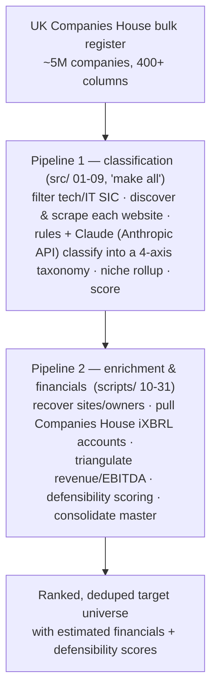

# UK Companies House — Tech-Services Screening Engine

A sourcing-and-screening engine that takes the **entire UK Companies House register
(~5M companies, 400+ columns)** down to a ranked, defensible shortlist of IT/tech-services
firms — automatically discovering each company's website, classifying it on a multi-axis
taxonomy, recovering its financials, and scoring it.

It is built to answer a buy-and-build question at register scale: *which founder-owned
tech-services companies actually fit a given roll-up thesis, including the ones no keyword
search would ever surface?*

---

## What the engine does — the flow



**Two pipelines, one register:**

- **Pipeline 1 — `src/` 01-09** (orchestrated by `make all`): the classification chain.
  Load the register → discover & scrape each firm's website → rules + **Claude** (Anthropic API)
  classification on a *stack-layer × function × business-model × vertical* taxonomy → roll up
  niches → score. See [Claude-powered classification](#claude-powered-classification).
- **Pipeline 2 — `scripts/` 10-31**: enrichment & financials. Website/owner recovery, Companies
  House accounts pulls (iXBRL), revenue/EBITDA triangulation, defensibility scoring, scope
  gating, and consolidation into a single master table.

A second lightweight entry point, `sector_screen.py` (see [`README_sector_screen.md`](README_sector_screen.md)),
runs a fast SIC-based first-cut screen over the same bulk register.

---

## Claude-powered classification

The classification step — turning a firm's name, SIC code and scraped website text into a strict,
schema-validated label across *stack-layer × function × business-model × vertical* — runs on
**Claude via the [Anthropic API](https://docs.anthropic.com/en/api)**. It lives in
[`src/05_classify_llm.py`](src/05_classify_llm.py):

- Official `anthropic` Python SDK (`client.messages.create`), default model **`claude-opus-4-8`**.
- The frozen rubric in [`schema/taxonomy.py`](schema/taxonomy.py) is sent as a **prompt-cached**
  system prompt, so every call after the first pays ~0.1× for it.
- Output is **strict JSON validated against closed enums** (`ClassificationOutput`); off-vocabulary
  labels are repaired or routed to `needs_review`, never silently coerced.
- Every result is **cached on disk** keyed by model + prompt version — re-runs are free and a
  crashed run resumes for nothing.

```bash
pip install -r requirements.txt
export ANTHROPIC_API_KEY=sk-ant-...

python3 src/05_classify_llm.py --gold              # classify the gold set (default, low-spend)
CLASSIFY_MODEL=claude-haiku-4-5 \
  python3 src/05_classify_llm.py --gold            # cheaper model for a high-volume run
```

**Two ways to run the classifier:**

- **Anthropic API (`src/05`, the production path):** scripted, prompt-cached, checkpointed and resumable. This is the way to run it unattended at register scale.
- **Within Claude (no API key):** feed the same blind inputs (name + SIC + scraped website text) and the rubric to any Claude session (a chat or an agent) and have it return the labels. This is how the gold-set agreement figures were reproduced; it is ideal for the gold set or spot-checks, while the API path is what scales to the full register.

> **Scope — mixed-provider, not Claude end-to-end.** Claude does the **core classification**
> (`src/05`). Some downstream enrichment steps under `scripts/` (niche one-liners, descriptors,
> defensibility scoring) use a **separate LLM (Google Gemini)**, which is why `requirements.txt`
> also pulls `google-genai`.

---

## How to read the numbers (important)

Most small UK companies file under the **small-company P&L exemption — no income statement is
public.** Any target EBITDA figure this engine produces is therefore an **estimate**, triangulated
from balance sheets, deferred income and headcount. Treat them as an **opening frame for a
Quality-of-Earnings review, not numbers to wire against.**

---

## Layout

| Path | What it is |
|---|---|
| `src/01-09` | Pipeline 1: classification chain (load → scrape → classify → rollup → score) |
| `scripts/10-31` | Pipeline 2: enrichment, financials, revenue triangulation, defensibility, master |
| `schema/` | The classification taxonomy + screening-metric definitions |
| `gold/` | Labeled gold set for measuring classifier accuracy |
| `sector_screen.py`, `filter_tech_sic.py` | Standalone SIC-based first-cut screens |
| `Makefile` | Timestamp-cached orchestration (`make all`, `make help`) |

---

## What's included vs. not

- **Included:** all source code (~43 Python files across `src/`, `scripts/`, `schema/`), the
  classification gold set, and the `Makefile` orchestration.
- **Not included (by design):** the raw ~1.3 GB Companies House data lake and the cached website
  scrapes — all **regenerable by running the code** — and any API keys. The repo is
  *reproducible-by-code*; the bulky data state lives locally.

To run it you need an **`ANTHROPIC_API_KEY`** (classification, `src/05`), a Companies House API
key, a search API key (for website discovery), and a Gemini key (the `scripts/` enrichment steps),
then `make all` for the classification pipeline.
Run `make help` to list targets.

---

## License

[MIT](LICENSE). A short writeup of the method is in [`WRITEUP.md`](WRITEUP.md).
