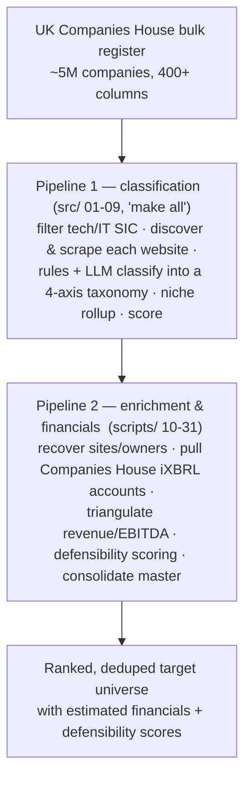

# UK Companies House — Tech-Services Screening Engine

A sourcing-and-screening engine that takes the **entire UK Companies House register
(~5M companies, 400+ columns)** down to a ranked, defensible shortlist of IT/tech-services
firms — automatically discovering each company's website, classifying it on a multi-axis
taxonomy, recovering its financials, and scoring it.

It is built to answer a buy-and-build question at register scale: *which founder-owned
tech-services companies actually fit a given roll-up thesis, including the ones no keyword
search would ever surface?*

---

## What the engine does — the flow

**Two pipelines, one register:**

- **Pipeline 1 — `src/` 01-09** (orchestrated by `make all`): the classification chain.
  Load the register → discover & scrape each firm's website → rules + LLM classification on a
  *stack-layer × function × business-model × vertical* taxonomy → roll up niches → score.
- **Pipeline 2 — `scripts/` 10-31**: enrichment & financials. Website/owner recovery, Companies
  House accounts pulls (iXBRL), revenue/EBITDA triangulation, defensibility scoring, scope
  gating, and consolidation into a single master table.

A second lightweight entry point, `sector_screen.py` (see [`README_sector_screen.md`](README_sector_screen.md)),
runs a fast SIC-based first-cut screen over the same bulk register.

---

## How to read the numbers (important)

Most small UK companies file under the **small-company P&L exemption — no income statement is
public.** Any target EBITDA figure this engine produces is therefore an **estimate**, triangulated
from balance sheets, deferred income and headcount. Treat them as an **opening frame for a
Quality-of-Earnings review, not numbers to wire against.**

---

## Layout

| Path | What it is |
|---|---|
| `src/01-09` | Pipeline 1: classification chain (load → scrape → classify → rollup → score) |
| `scripts/10-31` | Pipeline 2: enrichment, financials, revenue triangulation, defensibility, master |
| `schema/` | The classification taxonomy + screening-metric definitions |
| `gold/` | Labeled gold set for measuring classifier accuracy |
| `sector_screen.py`, `filter_tech_sic.py` | Standalone SIC-based first-cut screens |
| `Makefile` | Timestamp-cached orchestration (`make all`, `make help`) |

---

## What's included vs. not

- **Included:** all source code (~43 Python files across `src/`, `scripts/`, `schema/`), the
  classification gold set, and the `Makefile` orchestration.
- **Not included (by design):** the raw ~1.3 GB Companies House data lake and the cached website
  scrapes — all **regenerable by running the code** — and any API keys. The repo is
  *reproducible-by-code*; the bulky data state lives locally.

To run it you need a Companies House API key, an LLM API key (for classification), and a search
API key (for website discovery), then `make all` for the classification pipeline. Run `make help`
to list targets.
